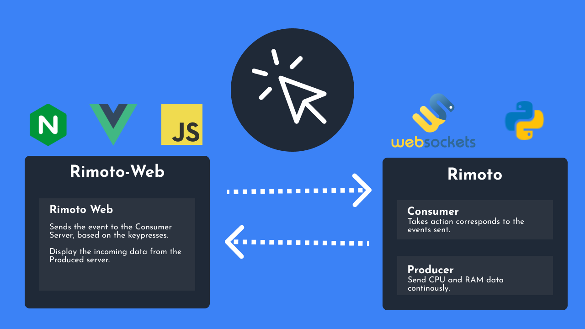
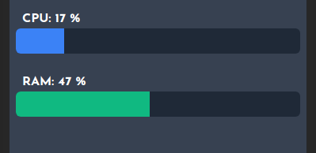
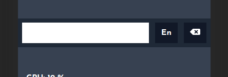

<h1 align="center">Rimoto</h1>
<p align="center">Control your computer with phone.</p>
Rimoto Web is a simple web app that communicates with a websocket server called rimoto which allow you control your computer with any device like phone.

<p align="center">
  
</p>

## How to use it ?
1. Clone the repository.
```bash
git clone https://github.com/vivekascoder/rimoto
git clone https://github.com/vivekascoder/rimoto-web
```
2. Install the dependencies.
```bash
cd rimoto
python3 -m venv env
source ./env/bin/activate
pip install -r ./requirements.txt
```
1. Then run the `rimoto` server.
```bash
python3 ./rimoto.py
```
4. Run the `rimoto-web` by opening a new terminal.
   1. Going to the `rimoto-web folder.
   2. Then going to the dist directory.
   3. Then using the `live-server` node package or 
   ```bash
   python3 -m http.server
   ```
5. How to set the local ip address of computer?
If linux use the command `ifconfig` and in windows use `ipconfig`.

## Inspiration
One day i was watching movie in my laptop and my laptop was far away from me, 
Then i started thinking 🤔, can i make something with which i will be able
to controll the movie, like play/pause volume up/down, This weekend i finally 
build that web app that can save us.


## Accomplishments that we're proud of.
- The web app can show the live CPU and RAM usage of your computer.
<p align="center">
  
</p>

- It can run on any device which ca run a web browser.
- The web app can also be used as a keyboard, whatever you type in the textbox will be reflected in your computer as well.
<p align="center">
  
</p>

## What we learned
- I've learned how to implement the web socket protocol using pythong without  using much third party tools and libraries.
- I've used `websockets` library to implement the websocket server.
- For geting the CPU and RAM usage I've learned how to use `psutil`.
- I've Learnt how to handle the websocket protocol using VueJs.

## What's next for Rimoto
- Making the websocket server SSL protected, so that i would be able to access
the rimoto-web application from the website itself.
- Making it cross platform.
- Improving the UI.
- Adding graphs to show cpu usage.

## Built with
`Python`, `Javascript`, `VueJs`, `Websocket`, `Linode`, `NginX`.


## If you worked on the project beforehand, what did you specifically work on this weekend?
At that point of time, I'll be working on making it cross platform and making the
Websocket server SSL protected which would have allowed me to access the 
rimoto-web using thre website itself.

## Did you register a Domain.com domain name this weekend? If so, what domain did you register?
No

## Do you want to livestream demo your hack at the closing ceremony?
I would love to do that.